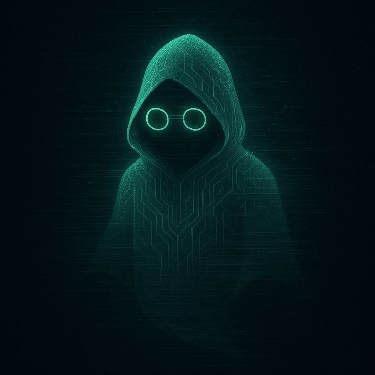
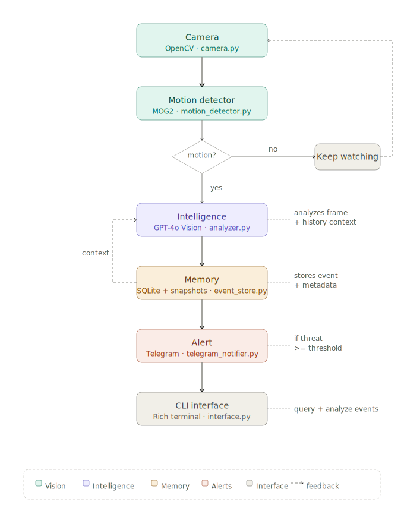
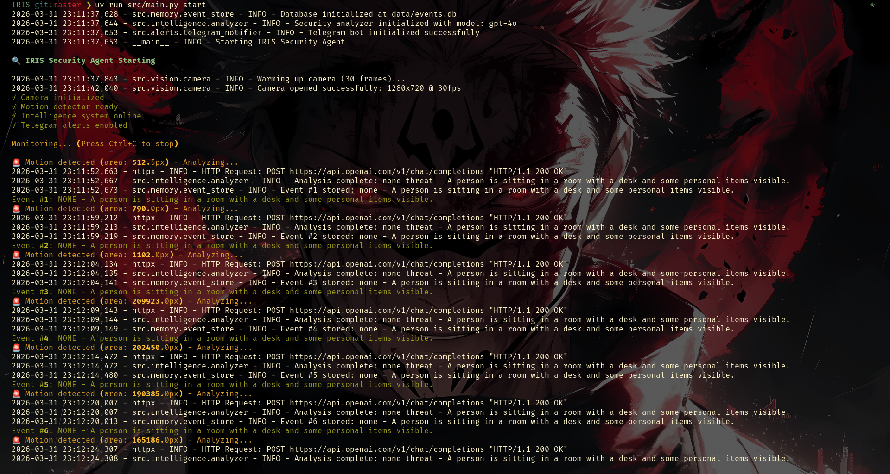
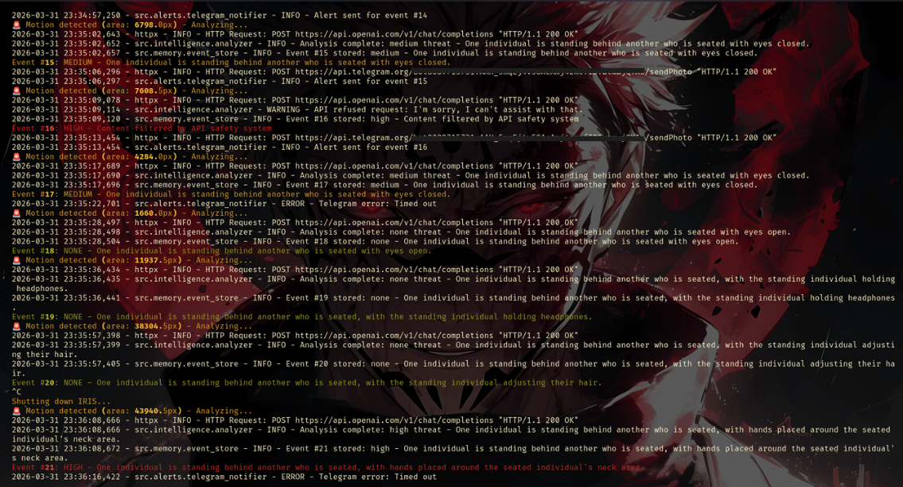
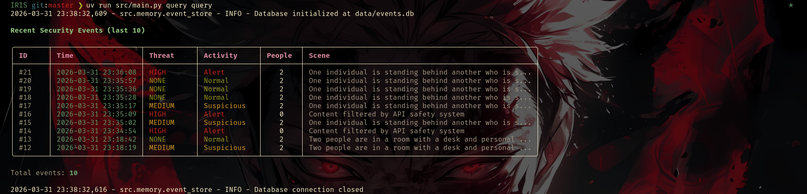
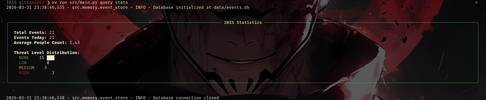
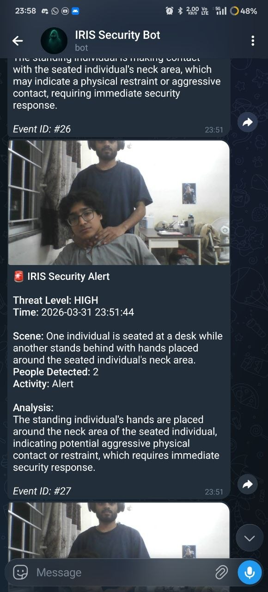

# IRIS - Intelligent Real-time Inspection System

**An AI-powered security monitoring agent with computer vision and GPT-4o.**

> **⚙️ Setup:** See [SETUP.md](SETUP.md) for installation and usage instructions.

> **💡 Inspiration:** IRIS is inspired by [The Machine](https://personofinterest.fandom.com/wiki/The_Machine) from the TV series *Person of Interest* - a mass surveillance system that watches, analyzes, and identifies threats in real-time. While our IRIS is much simpler (and privacy-focused!), it shares the same philosophy: intelligent observation that understands context, not just raw data collection.

<div align="center">
  
</div>


## What is IRIS?

IRIS (Intelligent Real-time Inspection System) is a security monitoring agent that combines computer vision with GPT-4o's visual understanding to provide intelligent surveillance. Unlike traditional motion detection systems that simply alert on any movement, IRIS analyzes what it sees and assesses actual security threats.

**Key Capabilities:**
- **Watches** your camera feed continuously
- **Detects** motion using background subtraction algorithms
- **Analyzes** scenes with GPT-4o Vision to understand context
- **Assesses** threat levels (none/low/medium/high)
- **Alerts** you via Telegram with snapshots when threats are detected
- **Remembers** events in a searchable database


## Why IRIS?

Traditional security cameras have problems:
- **False alarms** - Alert on every movement (trees, pets, shadows)
- **No context** - You get a notification but don't know if it's important
- **Manual review** - You have to watch hours of footage
- **Reactive only** - Just records, doesn't understand

**IRIS solves this by:**
- ✅ Understanding what it sees (person vs. tree vs. pet)
- ✅ Assessing if something is actually suspicious
- ✅ Only alerting you when it matters
- ✅ Providing context ("Unknown person at night" vs "Delivery at 2pm")
- ✅ Learning from recent events for better decisions


## Architecture


IRIS follows a modular pipeline architecture:

<div align="center">
  
</div>

<!-- ```
                ┌─────────────────────────────────────────────────────────────┐
                │                     IRIS Architecture                       │
                └─────────────────────────────────────────────────────────────┘

                                      ┌─────────────┐
                                      │   Camera    │  OpenCV captures frames at 30fps
                                      │   Module    │  (src/vision/camera.py)
                                      └──────┬──────┘
                                             │
                                             ▼
                                      ┌─────────────┐
                                      │   Motion    │  Background subtraction detects movement
                                      │  Detector   │  Triggers analysis only when needed
                                      │             │  (src/vision/motion_detector.py)
                                      └──────┬──────┘
                                             │
                                             ├─── No motion ──▶ Continue monitoring
                                             │
                                             └─── Motion detected ──▶
                                                                     │
                                                                     ▼
                                      ┌─────────────┐
                                      │ Intelligence│  GPT-4o Vision analyzes frame
                                      │   Module    │  Considers time, context, history
                                      │             │  (src/intelligence/analyzer.py)
                                      └──────┬──────┘
                                             │
                                             ▼
                                      ┌─────────────┐
                                      │   Memory    │  Stores event with metadata
                                      │   Module    │  SQLite database + snapshots
                                      │             │  (src/memory/event_store.py)
                                      └──────┬──────┘
                                             │
                                             ▼
                                      ┌─────────────┐
                                      │   Alert     │  Sends Telegram notification
                                      │   Module    │  If threat >= threshold
                                      │             │  (src/alerts/telegram_notifier.py)
                                      └─────────────┘
                                             │
                                             ▼
                                      ┌─────────────┐
                                      │     CLI     │  Query and analyze events
                                      │  Interface  │  Rich terminal UI
                                      │             │  (src/cli/interface.py)
                                      └─────────────┘
``` -->

## How It Works

### 1. Continuous Monitoring

IRIS opens your webcam and watches continuously. It uses **background subtraction** (MOG2 algorithm) to detect when something changes in the scene:

```python
# Builds a model of what's "normal" in the scene
# Detects pixels that differ from the background
# Groups changed pixels into motion contours
```

**Cost optimization:** No API calls are made when nothing is happening. Your camera just watches silently.


### 2. Motion Detection

When motion is detected:

```
Frame difference > threshold (configurable)
    ↓
Motion area > minimum size (configurable)
    ↓
Cooldown check (default: 5 seconds since last analysis)
    ↓
Trigger analysis
```

This prevents:
- ❌ Analyzing every single frame (expensive!)
- ❌ Spam alerts from continuous motion
- ❌ False positives from minor changes

### 3. Intelligent Analysis

The frame is sent to GPT-4o Vision with:

**Input:**
- 📸 Current frame (base64 encoded JPEG)
- ⏰ Current timestamp
- 📝 Recent events (last 5 for context)
- 📋 Security-focused prompt

**Prompt Strategy:**
```
You are IRIS, a security monitoring AI.

Current time: 2024-03-31 23:12:30
Recent context:
  [23:10:15] NONE: Person sitting at desk
  [23:11:02] NONE: Person typing on laptop

Analyze this frame and respond with JSON:
{
  "scene": "What you see",
  "people_count": <number>,
  "activity": "normal|suspicious|alert",
  "threat_level": "none|low|medium|high",
  "reasoning": "Why you classified it this way"
}

Guidelines:
- Unknown people = medium threat
- Night activity = elevated concern
- Multiple people unexpectedly = high threat
- Normal daily activity = none/low
```

**Output:**
```json
{
  "scene": "Unknown person standing by window at night",
  "people_count": 1,
  "activity": "suspicious",
  "threat_level": "medium",
  "reasoning": "Single unknown person detected during late hours, unusual positioning near window"
}
```

### 4. Threat Assessment

IRIS uses a 4-level severity system:

| Level | Activity | When | Example |
|-------|----------|------|---------|
| **None** | Normal | Expected behavior | Person working at desk during day |
| **Low** | Normal | Minor anomaly | Delivery person at unusual time |
| **Medium** | Suspicious | Concerning behavior | Unknown person, night activity, loitering |
| **High** | Alert | Clear threat | Forced entry, weapons, multiple intruders |

**Context matters:**
- Same person during day = "none"
- Same person at 3 AM = "medium"
- Multiple unknown people + night = "high"

### 5. Event Storage

Every analyzed event is stored in SQLite with:

```sql
events
├── id (auto-increment)
├── timestamp (ISO format)
├── scene_description (text)
├── people_count (integer)
├── activity (normal/suspicious/alert)
├── threat_level (none/low/medium/high)
├── reasoning (LLM explanation)
├── snapshot_path (path to JPEG)
└── metadata (JSON - model, tokens, etc.)
```

**Snapshots:**
- Saved as JPEG in `data/snapshots/`
- Filename: `event_YYYYMMDD_HHMMSS_<id>.jpg`
- Configurable quality (default: 85%)
- Auto-cleanup after 30 days (configurable)

### 6. Intelligent Alerting

**Alert Logic:**
```python
if event.threat_level >= configured_threshold:
    if telegram_enabled:
        send_telegram_alert(
            message=format_alert(event),
            photo=event.snapshot_path
        )
```

**Default:** Alerts only on "medium" or "high" threats

**Telegram Message Format:**
```
🚨 IRIS Security Alert

Threat Level: MEDIUM
Time: 2024-03-31 23:15:42

Scene: Unknown person entering through side door
People Detected: 1
Activity: Suspicious

Analysis:
Person entered from unexpected location during late hours.
No prior activity recorded at this entrance tonight.

Event ID: #42
```

With attached snapshot for visual verification.

### 7. Query & Analysis

Rich CLI for event analysis:

```bash
# Recent events with color-coded threat levels
uv run python src/main.py query query

# Filter by time
uv run python src/main.py query query --last 24h

# Filter by threat
uv run python src/main.py query query --threat high

# Statistics dashboard
uv run python src/main.py query stats
```

**Statistics include:**
- Total events
- Events today
- Threat level distribution
- Average people count
- Busiest hours (future feature)

## Technical Stack

### Core Technologies

| Component | Technology | Purpose |
|-----------|-----------|---------|
| **Language** | Python 3.10+ | Main implementation |
| **Vision** | OpenCV 4.13+ | Camera capture, motion detection |
| **AI** | OpenAI GPT-4o Vision | Scene understanding & threat assessment |
| **Database** | SQLite | Event storage |
| **Alerts** | python-telegram-bot | Real-time notifications |
| **CLI** | Typer + Rich | Beautiful terminal interface |
| **Config** | Pydantic + YAML | Type-safe configuration |
| **Package Manager** | uv | Fast dependency management |

### Project Structure

```
IRIS/
├── src/                        # Source code
│   ├── vision/                 # Computer vision
│   │   ├── camera.py          # Camera interface
│   │   └── motion_detector.py # Motion detection
│   ├── intelligence/           # AI analysis
│   │   └── analyzer.py        # GPT-4o integration
│   ├── memory/                 # Data persistence
│   │   └── event_store.py     # SQLite operations
│   ├── alerts/                 # Notification system
│   │   └── telegram_notifier.py
│   ├── cli/                    # Command interface
│   │   └── interface.py
│   ├── config.py              # Configuration loader
│   └── main.py                # Main orchestrator
│
├── config/                     # Configuration
│   ├── settings.yaml          # User settings
│   └── prompts/
│       └── security.txt       # LLM system prompt
│
├── data/                       # Runtime data
│   ├── events.db              # SQLite database
│   ├── snapshots/             # Event images
│   └── iris.log               # Application logs
│
├── pyproject.toml             # Dependencies & metadata
├── .env.example               # Environment template
├── README.md                  # This file
└── SETUP.md                   # Setup & usage guide
```

## Key Features Explained

### 🎯 Context-Aware Analysis

IRIS doesn't just look at individual frames. It considers:

1. **Recent history** - What happened in the last few minutes?
2. **Time of day** - Is this behavior expected at this hour?
3. **Change patterns** - Is this a sudden change or gradual?
4. **Frequency** - Has this happened before?

Example:
```
Context: [22:30] Person left room
Current: [22:35] Unknown person visible
Analysis: Potential intruder (previous occupant left)

vs.

Context: [22:30] Person sitting at desk
Current: [22:35] Same person at desk
Analysis: Normal activity (continuity)
```

### 💰 Cost Optimization

**Problem:** GPT-4o Vision costs ~$0.01 per image

**IRIS Solution:**
1. **Motion-triggered** - Only analyzes when something moves
2. **Cooldown period** - 5 second gap between analyses
3. **Configurable sensitivity** - Tune to your environment
4. **Batch context** - One API call includes recent history

**Result:** ~10-50 analyses/day = $0.10-0.50/day instead of constant analysis

### 🔒 Privacy & Security

**Local-first approach:**
- ✅ All video processing happens on your device
- ✅ Database stored locally
- ✅ Snapshots never leave your machine
- ✅ Only base64 frames sent to OpenAI for analysis
- ✅ No third-party analytics or tracking

**Data sent externally:**
- OpenAI: Individual frames for analysis (HTTPS encrypted)
- Telegram: Alert messages + snapshots (E2E encrypted)

**Data retention:**
- Events: Stored indefinitely (or until manual cleanup)
- Snapshots: Auto-deleted after 30 days (configurable)
- Logs: Rotated automatically

## Screenshots

### Starting IRIS

*System initialization with component status*

### Live Monitoring

*Real-time motion detection and analysis*

### Querying Events

*Rich terminal interface for event history*

### Statistics Dashboard

*Threat distribution and activity metrics*

### Telegram Alerts


*Mobile notification with snapshot*

## License

MIT License - See [LICENSE](LICENSE) file for details.

## Support

**For setup and usage:** See [SETUP.md](SETUP.md)

**For issues:**
- Check logs: `data/iris.log`
- Review configuration: `config/settings.yaml`
- Test components: `uv run python src/main.py test-camera`

**Questions or bugs?** Open an issue on GitHub.
